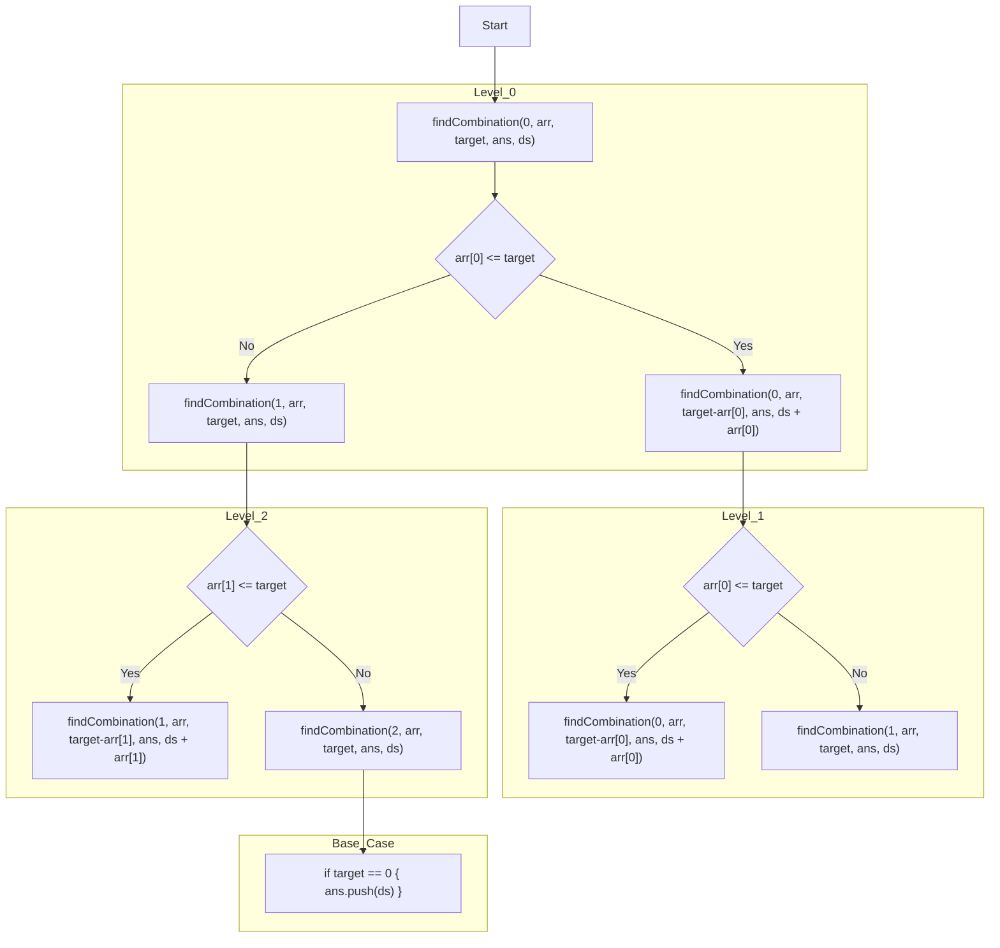
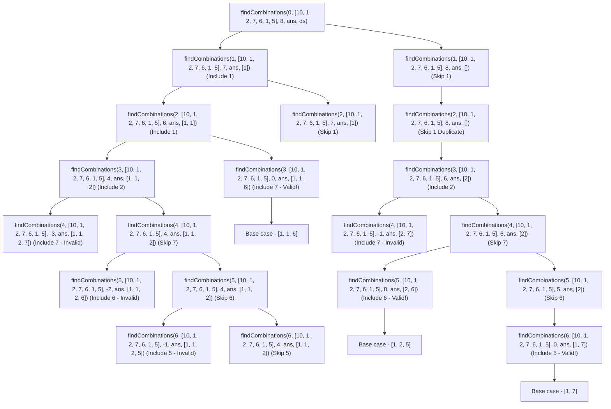
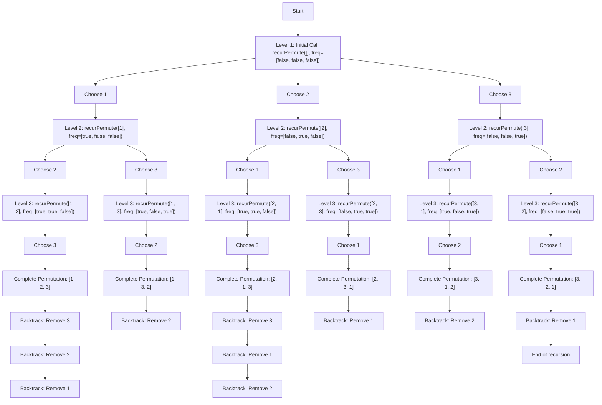
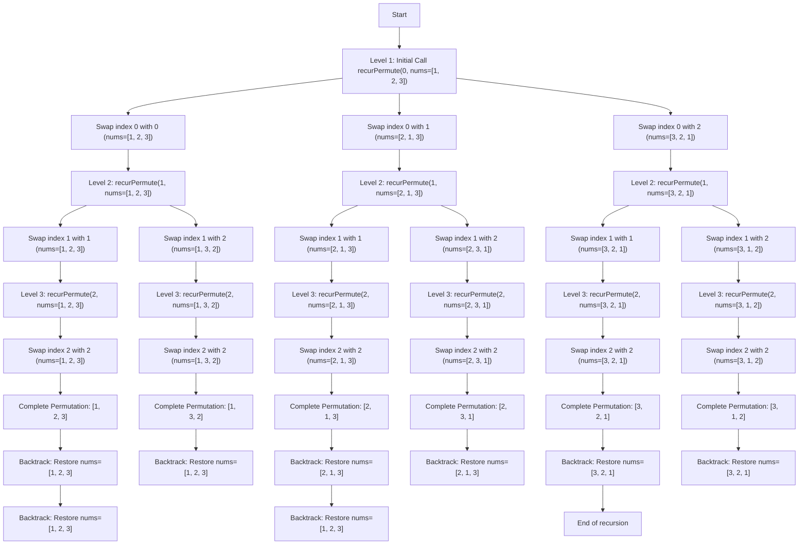
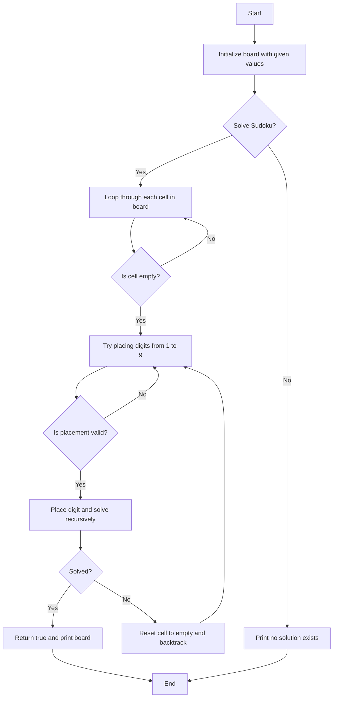

# Recursion

#### Combination Sum

Given a set of candidate numbers (candidates) (without duplicates) and a target number (target), find all unique combinations in candidates where the candidate numbers sums to target.

```tsx
function findCombination(ind: number, arr: number[], target: number, ans: number[][], ds: number[]) {
  if(ind == arr.length) {
    if(target == 0) {
      ans.push([...ds]);
    }
    return;
  }

  if(arr[ind] <= target) {
    ds.push(arr[ind]);
    findCombination(ind, arr, target - arr[ind], ans, ds);
    ds.pop();
  }

  findCombination(ind + 1, arr, target, ans, ds);
}


function combinationSum(candidates: number[], target: number): number[][] {

  let ans = []
  findCombination(0, candidates, target, ans, []);
  return ans
};

console.log(combinationSum([2, 3, 6, 7], 7));
```




#### Combination Sum II


```tsx
function findCombinations(ind, arr, target, ans, ds) {
  // Base case: if target is 0, add the current combination to the answer list
  if (target === 0) {
      ans.push([...ds]); // Copy the current combination and add it to ans
      return;
  }

  // Recursive case: iterate through the array
  for (let i = ind; i < arr.length; i++) {
      // Skip duplicates
      if (i > ind && arr[i] === arr[i - 1]) continue;
      
      // Break if the current number is greater than the target
      if (arr[i] > target) break;

      // Add the current number to the combination
      ds.push(arr[i]);

      // Recursive call to find combinations with updated index and reduced target
      findCombinations(i + 1, arr, target - arr[i], ans, ds);

      // Backtrack by removing the last element added
      ds.pop();
  }
}

function combinationSum2(candidates, target) {
  const ans = [];
  candidates.sort((a, b) => a - b); // Sort the candidates to handle duplicates
  findCombinations(0, candidates, target, ans, []);
  return ans;
}

// Example usage:
const candidates = [10, 1, 2, 7, 6, 1, 5];
const target = 8;
const result = combinationSum2(candidates, target);
console.log(result);

```





#### Subset Sum II

```tsx
function findSubsets(ind: number, nums, ds: number[], ans: number[][]) {
  ans.push([...ds]);
  for (let i = ind; i < nums.length; i++) {
    if (i !== ind && nums[i] === nums[i - 1]) continue;
    ds.push(nums[i]);
    findSubsets(i + 1, nums, ds, ans);
    ds.pop();
  }
}

function subsetsWithDup(nums: number[]): number[][] {
  let ans = [];
  nums.sort();
  findSubsets(0, nums, [], ans);
  return ans;
}
```




```mermaid
graph TD
    A["findSubsets(0, [1, 1, 2, 4], [], ans)"] 
    A --> B1["findSubsets(1, [1, 1, 2, 4], [1], ans) (Include 1)"]
    A --> C1["findSubsets(1, [1, 1, 2, 4], [], ans) (Skip 1)"]

    %% First Subtree (Starting with 1)
    B1 --> B2["findSubsets(2, [1, 1, 2, 4], [1, 1], ans) (Include 1)"]
    B1 --> C2["findSubsets(2, [1, 1, 2, 4], [1], ans) (Skip 1)"]
    
    %% First Subtree when [1, 1] is included
    B2 --> B3["findSubsets(3, [1, 1, 2, 4], [1, 1, 2], ans) (Include 2)"]
    B3 --> B4["findSubsets(4, [1, 1, 2, 4], [1, 1, 2, 4], ans) (Include 4)"]
    B4 --> V1["Base case - Add [1, 1, 2, 4] to ans"]

    B3 --> C3["findSubsets(4, [1, 1, 2, 4], [1, 1, 2], ans) (Skip 4)"]
    C3 --> V2["Base case - Add [1, 1, 2] to ans"]
    
    B2 --> C4["findSubsets(3, [1, 1, 2, 4], [1, 1], ans) (Skip 2)"]
    C4 --> B5["findSubsets(4, [1, 1, 2, 4], [1, 1, 4], ans) (Include 4)"]
    B5 --> V3["Base case - Add [1, 1, 4] to ans"]
    C4 --> V4["Base case - Add [1, 1] to ans"]

    %% First Subtree when [1] is included, [1] skipped
    C2 --> B6["findSubsets(3, [1, 1, 2, 4], [1, 2], ans) (Include 2)"]
    B6 --> B7["findSubsets(4, [1, 1, 2, 4], [1, 2, 4], ans) (Include 4)"]
    B7 --> V5["Base case - Add [1, 2, 4] to ans"]

    B6 --> C5["findSubsets(4, [1, 1, 2, 4], [1, 2], ans) (Skip 4)"]
    C5 --> V6["Base case - Add [1, 2] to ans"]

    C2 --> B8["findSubsets(4, [1, 1, 2, 4], [1, 4], ans) (Include 4)"]
    B8 --> V7["Base case - Add [1, 4] to ans"]
    C2 --> V8["Base case - Add [1] to ans"]

    %% Skip duplicate 1 (first subtree skipping [1, 1])
    C1 --> B9["findSubsets(2, [1, 1, 2, 4], [2], ans) (Include 2)"]
    B9 --> B10["findSubsets(3, [1, 1, 2, 4], [2, 4], ans) (Include 4)"]
    B10 --> V9["Base case - Add [2, 4] to ans"]

    B9 --> C6["findSubsets(4, [1, 1, 2, 4], [2], ans) (Skip 4)"]
    C6 --> V10["Base case - Add [2] to ans"]

    C1 --> B11["findSubsets(3, [1, 1, 2, 4], [4], ans) (Include 4)"]
    B11 --> V11["Base case - Add [4] to ans"]
    C1 --> V12["Base case - Add [] to ans"]

```

#### Permutations

```tsx
function permute(nums: number[]): number[][] {
    const ans: number[][] = [];
    const ds: number[] = [];
    const freq: boolean[] = Array(nums.length).fill(false);

    function recurPermute(ds: number[], nums: number[], ans: number[][], freq: boolean[]): void {
        if (ds.length === nums.length) {
            ans.push([...ds]); // Push a copy of ds to avoid mutation
            return;
        }
        for (let i = 0; i < nums.length; i++) {
            if (!freq[i]) {
                ds.push(nums[i]);
                freq[i] = true;
                recurPermute(ds, nums, ans, freq);
                freq[i] = false;
                ds.pop();
            }
        }
    }

    recurPermute(ds, nums, ans, freq);
    return ans;
}

// Usage example
const nums = [1, 2, 3];
console.log("All Permutations are:", permute(nums));
```



#### Permutations Swap

```tsx
function permute(nums: number[]): number[][] {
    const ans: number[][] = [];

    function recurPermute(index: number): void {
        if (index === nums.length) {
            ans.push([...nums]); // Push a copy of nums to avoid reference issues
            return;
        }
        for (let i = index; i < nums.length; i++) {
            [nums[index], nums[i]] = [nums[i], nums[index]]; // Swap elements
            recurPermute(index + 1);
            [nums[index], nums[i]] = [nums[i], nums[index]]; // Backtrack by swapping back
        }
    }

    recurPermute(0);
    return ans;
}

// Example usage
const nums = [1, 2, 3];
const permutations = permute(nums);
console.log("All Permutations are:");
permutations.forEach(permutation => console.log(permutation));

```



#### Sudoku Solver

```tsx
type Board = (string | '.')[][];

function isValid(board: Board, row: number, col: number, c: string): boolean {
    for (let i = 0; i < 9; i++) {
        if (board[i][col] === c) return false;
        if (board[row][i] === c) return false;
        if (board[3 * Math.floor(row / 3) + Math.floor(i / 3)][3 * Math.floor(col / 3) + (i % 3)] === c) return false;
    }
    return true;
}

function solveSudoku(board: Board): boolean {
    for (let i = 0; i < board.length; i++) {
        for (let j = 0; j < board[0].length; j++) {
            if (board[i][j] === '.') {
                for (let c = '1'; c <= '9'; c = String.fromCharCode(c.charCodeAt(0) + 1)) {
                    if (isValid(board, i, j, c)) {
                        board[i][j] = c;

                        if (solveSudoku(board)) return true;
                        else board[i][j] = '.';
                    }
                }
                return false;
            }
        }
    }
    return true;
}

const board: Board = [
    ['9', '5', '7', '.', '1', '3', '.', '8', '4'],
    ['4', '8', '3', '.', '5', '7', '1', '.', '6'],
    ['.', '1', '2', '.', '4', '9', '5', '3', '7'],
    ['1', '7', '.', '3', '.', '4', '9', '.', '2'],
    ['5', '.', '4', '9', '7', '.', '3', '6', '.'],
    ['3', '.', '9', '5', '.', '8', '7', '.', '1'],
    ['8', '4', '5', '7', '9', '.', '6', '1', '3'],
    ['.', '9', '1', '.', '3', '6', '.', '7', '5'],
    ['7', '.', '6', '1', '8', '5', '4', '.', '9']
];

if (solveSudoku(board)) {
    board.forEach(row => console.log(row.join(" ")));
} else {
    console.log("No solution exists");
}
```

